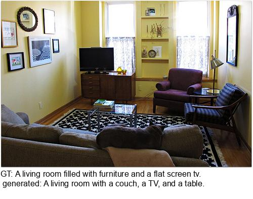
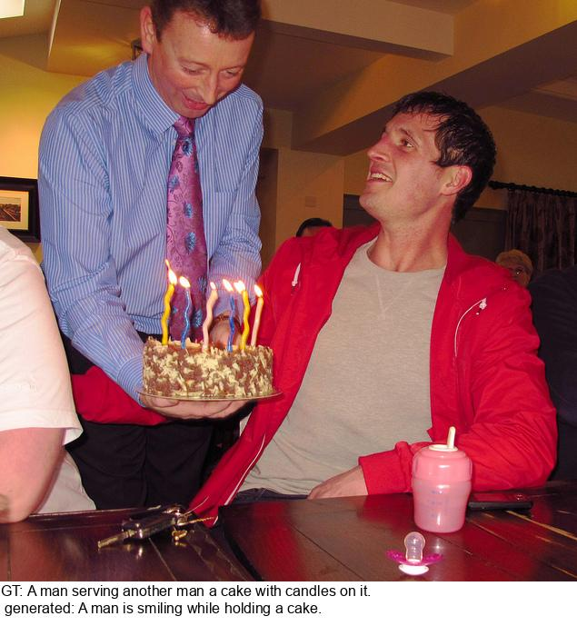

## Capincho ##

Image captioning composed of 3 modules: 1) a decoder only language model (OPT), 2) a vision-language model CLIP, 3) a embeddings mapper 
that maps CLIP embeddings to n OPT embeddings.  

Some examples from coco dataset, after training for 2 epochs and n=10:






### Installation ###
````angular2html
pip install git+https://github.com/openai/CLIP.git
pip install -r requirements.txt
````


### Usage ###
check the following files:

**extractFeatures.py** to extract the features vectors from coco dataset usin CLIP or open CLIP.

**trainDecoder.py**  to train the mapper module and finetune OPT, or a OPT LoRA model.

**evaluateCaptioning.py** to evaluate results.